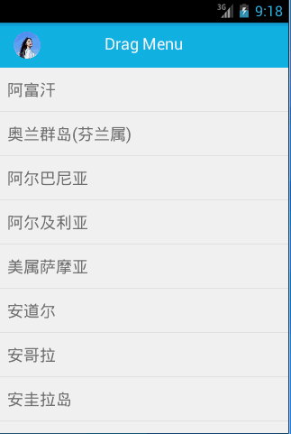

# DragMenu
Drag Menu with scale or translate. Project for 4.0+ version
##ScreenShot
<p>

&nbsp;&nbsp;&nbsp;

</p>

##Using
First you can add gradle dependency with command :
```groovy
  repositories {
    maven {
        url 'https://dl.bintray.com/henry-blue/maven/'
    }
  }
	dependencies {
	    ......
	    compile 'com.app.dragmenu:library:0.9.3'
	}

```
To add gradle dependency you need to open build.gradle (in your app folder,not in a project folder) then copy and add the dependencies there in the dependencies block;

After you need to use DragMenuLayout instead of root layout and have to create two child layout(instance of ViewGroup) at last. 
```xml
<app.dragmenu.com.library.DragMenuLayout xmlns:android="http://schemas.android.com/apk/res/android"
    xmlns:tools="http://schemas.android.com/tools"
    android:layout_width="match_parent"
    android:layout_height="match_parent">
    <LinearLayout
        android:layout_width="match_parent"
        android:layout_height="match_parent"
        android:background="#00aa00">
    </LinearLayout>
    
    <LinearLayout
        android:layout_width="match_parent"
        android:layout_height="match_parent"
        android:background="#0000aa">
    </LinearLayout>
</app.dragmenu.com.library.DragMenuLayout>
```


DragMenuLayout provides two kinds of attribute configuration: `dragRange`  and  `style` <br>
`dragRange` control the main layout of the drag range. 


```xml
<app.dragmenu.com.library.DragMenuLayout xmlns:android="http://schemas.android.com/apk/res/android"
    xmlns:tools="http://schemas.android.com/tools"
    android:layout_width="match_parent"
     android:layout_height="match_parent"
    app:dragRange="0.6" >
......
</app.dragmenu.com.library.DragMenuLayout>
```

`style` control drag style, if you want to scale style change 'style=Scale' and default style is Translate.

```xml
<app.dragmenu.com.library.DragMenuLayout xmlns:android="http://schemas.android.com/apk/res/android"
    xmlns:tools="http://schemas.android.com/tools"
    android:layout_width="match_parent"
     android:layout_height="match_parent"
    app:style="Scale" >
......
</app.dragmenu.com.library.DragMenuLayout>
```

You can get the control interface of DragMenuLayout by the following ways:

```java
mDragLayout.setDragStatusListener(new DragMenuLayout.OnDragStatusChangeListener() {

            @Override
            public void onOpen() {
            }

            @Override
            public void onDragging(float percent) {
            }

            @Override
            public void onClose() {
            }
        });
```


